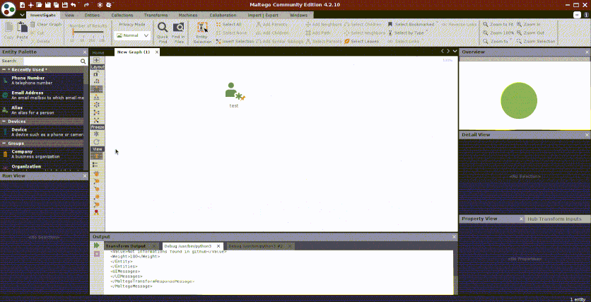

# Quidam maltego
# Educational purposes only
Permet d'utiliser [quidam](https://github.com/megadose/quidam/) avec maltego

## :bulb: Prérequis
   [Python 3](https://www.python.org/downloads/)
   
## :tools: Installation
####  Il faut commencer par clicker sur 

#### Ensuite remplir

#### Puis pour finir

## :chart_with_upwards_trend:Demo

## :pencil: License
[GNU General Public License v3.0](https://www.gnu.org/licenses/gpl-3.0.fr.html)

